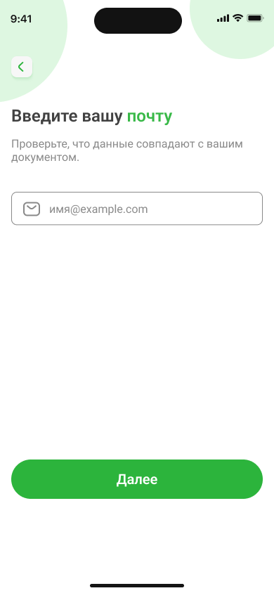
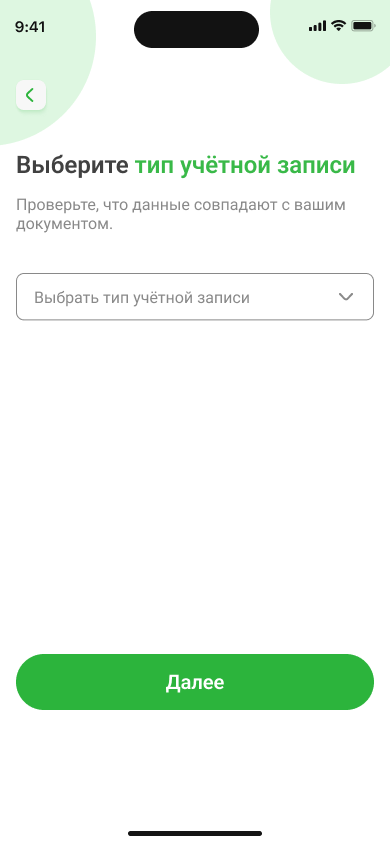
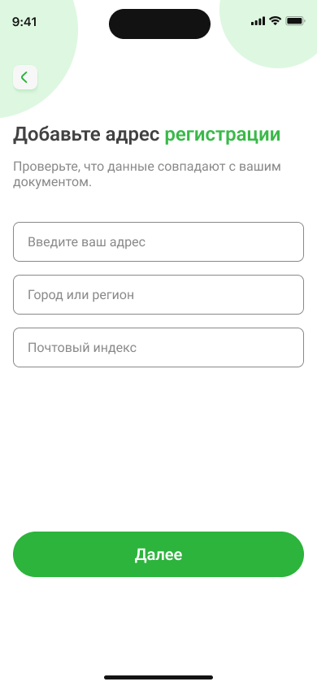

## **Настройка аккаунта**

### Для настройки аккаунта выполните следующие действия:

| Действие  |  Скриншот экрана приложения |
| -------  | ------- |
| Введите ваш адрес электронной почты |  |
| Выберите тип учетной записи из выпадающего списка |  |
| Укажите ваш адрес регистрации |  |
| Укажите ваши ФИО и дату рождения и нажмите **Далее** |  |

